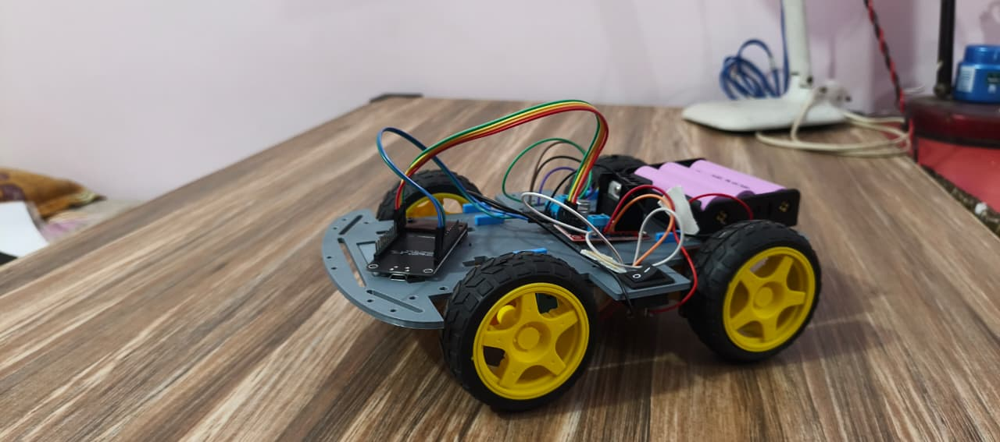

# AI Vision HandRover Bot


AI Vision HandRover Bot is a real-time gesture-controlled robotic system that integrates computer vision, wireless communication, and embedded motor control. The system detects hand gestures using OpenCV and MediaPipe and wirelessly controls an ESP8266-based robot via UDP communication.

---

## Tech Stack

- Python
- OpenCV
- MediaPipe (21-Point Hand Landmark Detection)
- ESP8266 (NodeMCU)
- L298N Motor Driver
- UDP & HTTP Communication
- Arduino IDE

---

## System Architecture

Camera → OpenCV → MediaPipe (Hand Landmarks) → Gesture Classification → UDP Transmission → ESP8266 → L298N → Motors

---

## Key Features

- Real-time hand tracking (~30 FPS)
- 21-point hand landmark detection
- Custom finger-count gesture classification
- Dual communication (UDP for AI + HTTP for manual control)
- ~50–100 ms end-to-end latency
- PWM-based motor control

---

## Gesture Mapping

| Gesture        | Command  |
|---------------|----------|
| 1 Finger      | Forward  |
| 2 Fingers     | Backward |
| 3 Fingers     | Left     |
| 4 Fingers     | Right    |
| Fist / Open   | Stop     |

---

## How It Works

1. OpenCV captures real-time camera feed.
2. MediaPipe detects 21 hand landmarks.
3. Gesture logic interprets finger positions.
4. Command sent via UDP to ESP8266.
5. ESP8266 controls motors through L298N driver.

---

## Code Example

```python
sock = socket.socket(socket.AF_INET, socket.SOCK_DGRAM)
command = "FORWARD"
sock.sendto(command.encode(), ("192.168.4.1", 1234))
